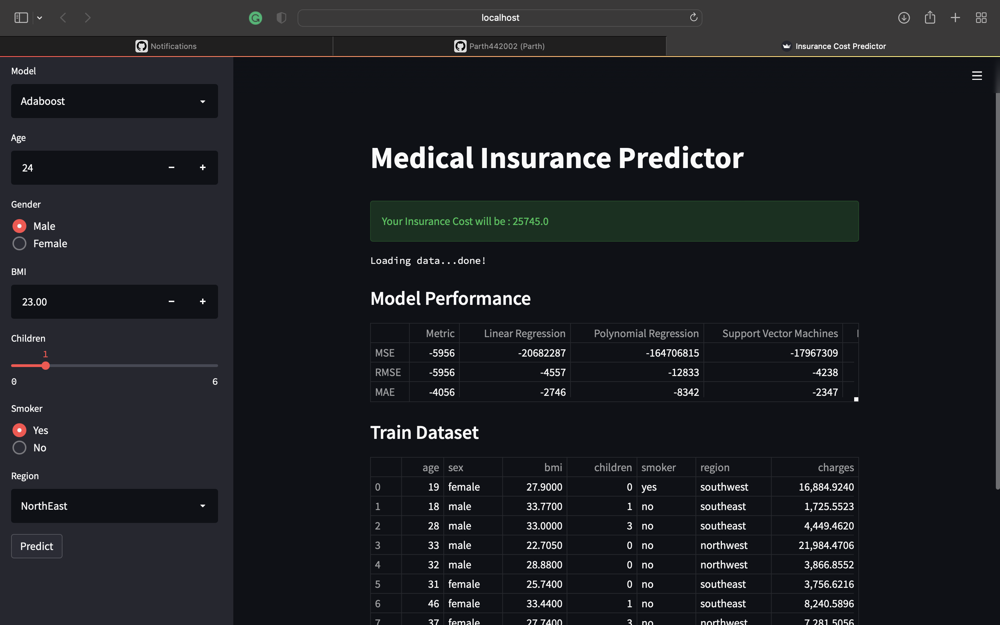
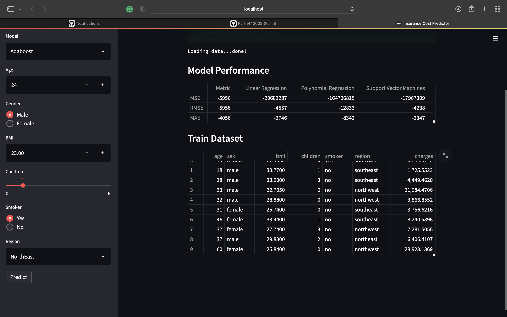

### Insurance Predictor
An Interactive Insurance Cost Predictor using regression techniques such as Polynomial Regression, Support Vector Machines, Random Forest etc.
It is deployed to Streamlit.

[Insurance Predictor](https://share.streamlit.io/parth442002/insurance_predictor/app.py#model-performance)

 

